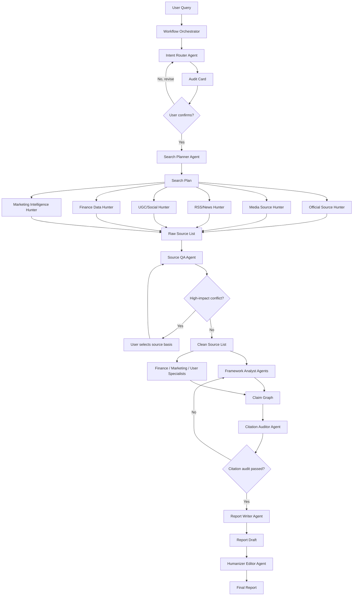

# Multi-Agent Search Workflow Design

**Date:** 2026-07-08
**Project:** search-agent-skill3.0
**Audience:** 百度地图市场组、调研工作流维护者、后续实现 agent

## Goal

Build a true multi-agent research pipeline for competitor, industry, finance, marketing, and user research. The system should not behave like a single agent with a long prompt. It should move structured artifacts from one agent node to the next, with explicit quality gates and source-backed outputs.

## Non-Goals

- Do not replace all existing tools at once.
- Do not make the CLI the primary intelligence layer.
- Do not let keyword matching decide research intent by itself.
- Do not produce final reports from templates before citation audit.
- Do not let Humanizer change facts, numbers, citations, or risk boundaries.

## Current Problem

The current project has the right pieces but not a reliable pipeline:

- `AGENTS.md` and `SKILL.md` define Step 0-3 at a high level.
- `references/agent-nodes.md` now defines node contracts and the required LLM-first decision stack.
- `lib/intent_classifier.py` provides useful fallback signals but cannot understand whole-user intent by itself.
- `lib/report_generator.py` can render structured reports and now has a conservative style cleanup pass.
- External skills are listed, but their outputs are not yet always captured as handoff artifacts.

The missing layer is an orchestrator that forces every agent to consume and produce typed artifacts.

## Design Principles

1. **LLM understanding first, rules second.** Rules are signal detectors and fallback paths. They do not own final intent classification.
2. **Artifacts over memory.** Every skill or agent result must be written into a structured artifact so later nodes can inspect it.
3. **Source IDs are the evidence spine.** No source ID, no factual claim.
4. **Parallelize only independent work.** Search across source classes can run in parallel; citation audit must wait for a complete draft.
5. **Human gates protect direction and trust.** The user confirms the audit card before search; citation failure blocks final report.
6. **Natural report, not AI template.** The report uses conclusion-first logic, then Humanizer Editor removes generic AI scaffolding.

## Architecture



## Artifact Contracts

### IntentBrief

Produced by Intent Router Agent.

```json
{
  "research_object": "高德地图",
  "user_decision": "判断百度地图是否需要跟进高德新功能",
  "audience": "百度地图市场组",
  "time_scope": "最近三个月",
  "output_shape": "竞品简报 + 行动建议",
  "evidence_need": ["官方更新", "应用商店", "媒体报道", "UGC反馈"],
  "ambiguity": ["是否启用内网知识库"],
  "semantic_signals": [
    {"signal": "上新了什么功能", "meaning": "竞品监测"},
    {"signal": "方案", "meaning": "需要行动建议"}
  ],
  "classifier_check": {
    "top_frameworks": ["同行竞争对比", "3C战略三角"],
    "conflicts": []
  },
  "preflight_skills": [
    {
      "skill": "marketing/competitor-profiling",
      "why": "补竞品档案维度",
      "status": "planned"
    }
  ]
}
```

### AuditCard

Produced by Intent Router Agent and shown to user. Search cannot start before confirmation.

Required fields:

- topic
- purpose
- LLM semantic read
- recommended framework or framework combination
- dimensions with concrete questions
- Chinese and English keyword families
- source scope
- planned expert skills
- open assumptions

### SearchPlan

Produced by Search Planner Agent.

```json
{
  "frameworks": ["同行竞争对比", "JTBD", "3C战略三角"],
  "tasks": [
    {
      "task_id": "SP001",
      "dimension": "竞品功能变化",
      "query_zh": ["高德地图 最近三个月 新功能", "高德地图 App Store 更新"],
      "query_en": ["Amap new features last 3 months"],
      "source_layers": ["official", "media", "app_store"],
      "expected_evidence": ["功能名称", "发布时间", "官方描述"],
      "source_id_prefix": "OFF"
    }
  ]
}
```

### SourceList

Produced by Source Hunter Agents.

```yaml
sources:
  - source_id: OFF001
    title: "高德地图 App 更新记录"
    publisher: "Apple App Store"
    source_type: 官方应用商店
    publish_date: 2026-06-30
    url: "https://..."
    confidence: high
    key_facts:
      - "版本更新包含暑期出行相关能力"
    full_text_fetched: true
    collected_by: Official Source Hunter
```

### SourceQANotes

Produced by Source QA Agent.

```json
{
  "deduped_count": 18,
  "removed_duplicates": ["MED004"],
  "stale_sources": ["RSS009"],
  "paywalled_summaries": ["MED003"],
  "number_conflicts": [
    {
      "metric": "MAU",
      "values": [
        {"source_id": "OFF002", "value": "4.5亿"},
        {"source_id": "MED006", "value": "5亿+"}
      ],
      "requires_user_decision": true
    }
  ],
  "approved_source_ids": ["OFF001", "MED002", "UGC003"]
}
```

### ClaimGraph

Produced by Framework Analyst and Specialist Agents.

```json
{
  "claims": [
    {
      "claim_id": "CL001",
      "dimension": "竞品功能变化",
      "claim_type": "fact",
      "text": "高德地图在最近三个月加强了暑期出行场景入口。",
      "source_ids": ["OFF001", "MED002"],
      "confidence": "high"
    },
    {
      "claim_id": "CL002",
      "dimension": "对百度地图启示",
      "claim_type": "judgment",
      "text": "百度地图应优先验证自然语言规划出行，而不是直接复制功能入口。",
      "source_ids": ["OFF001", "UGC003"],
      "confidence": "medium"
    }
  ]
}
```

### CitationAudit

Produced by Citation Auditor Agent.

```json
{
  "status": "pass",
  "issues": [],
  "required_rewrites": []
}
```

If the audit fails:

```json
{
  "status": "fail",
  "issues": [
    {
      "claim_id": "CL004",
      "problem": "source does not support the numeric claim",
      "required_action": "remove number or replace source"
    }
  ]
}
```

### ReportDraft and FinalReport

Produced by Report Writer Agent and Humanizer Editor Agent.

The report must keep:

- source-backed claims
- source IDs and reference links
- explicit uncertainty
- decision-oriented conclusion

The final pass removes:

- forced rule-of-three
- generic transitions
- abstract AI vocabulary
- inflated claims
- repeated section shapes that do not match the evidence

## Agent Nodes

### Workflow Orchestrator

**Purpose:** Own state and dispatch agents.

**Inputs:** User query, project config, available skill registry.

**Outputs:** Workflow state file and final report path.

**Responsibilities:**

- Create a workflow run ID.
- Store each artifact under `runs/<run_id>/`.
- Block search until AuditCard is confirmed.
- Dispatch source hunters in parallel.
- Route failed audits back to the right agent.
- Never create factual claims itself.

### Intent Router Agent

**Purpose:** Understand the user decision and route the framework.

**Skills:**

- `marketing-ideas`: fuzzy growth/marketing prompts.
- `marketing-plan`: full campaign/GTM/marketing plan prompts.
- `startup-analysis`: startup, VC, joining, fundraising prompts.
- `yfinance-data` or `funda-data`: single finance number prompts.
- `intent_classifier.py`: fallback signals and regression check.
- `framework_combinator.py`: minimal framework combination.

**Output:** `IntentBrief` and `AuditCard`.

**Hard rule:** Search is forbidden before user confirmation.

### Search Planner Agent

**Purpose:** Translate the confirmed AuditCard into an executable SearchPlan.

**Skills and references:**

- `references/search-platforms.md`
- `references/frameworks.md`
- keyword expansion rules from `SKILL.md`

**Output:** `SearchPlan`.

### Source Hunter Agents

**Purpose:** Collect evidence in parallel.

| Agent | Skills / tools | Source ID prefix |
|---|---|---|
| Official Source Hunter | Firecrawl, realtime-search Brave, SEC/IR/site search | OFF / FC / RS |
| Media Source Hunter | Firecrawl, realtime-search 百度/Brave | MED / FC / RS |
| RSS/News Hunter | finance-rss-reader, news-aggregator-skill | RSS / SOC |
| UGC/Social Hunter | agent-reach, B站, 小红书, 知乎, Reddit, X | UGC / SOC |
| Finance Data Hunter | yfinance-data, funda-data, TradingView, AKShare when available | FIN / DAT |
| Marketing Intelligence Hunter | competitor-profiling, customer-research, directory-submissions | MKT |

**Output:** partial `SourceList` files merged by Orchestrator.

### Source QA Agent

**Purpose:** Clean, rank, and challenge evidence.

**Responsibilities:**

- Deduplicate URLs.
- Normalize publisher and dates.
- Mark paywall summaries.
- Flag stale or low-confidence sources.
- Check key numbers across at least two independent sources when possible.
- Ask user when a high-impact metric conflicts.

**Output:** `SourceQANotes` and clean `SourceList`.

### Framework Analyst Agents

**Purpose:** Convert sources into a claim graph by framework.

Run one analyst per confirmed framework when independent:

- `PEST Analyst`
- `3C Analyst`
- `JTBD Analyst`
- `AARRR Analyst`
- `SWOT/Risk Analyst`
- `KPI/Finance Analyst`

**Output:** partial `ClaimGraph` files merged by Orchestrator.

### Specialist Agents

**Purpose:** Add domain-specific analysis that a generic analyst would miss.

| Specialist | Trigger | Skills |
|---|---|---|
| Finance Specialist | 财报、估值、股价、ROE、现金流、投资判断 | yfinance-data, funda-data, earnings-recap, company-valuation |
| Marketing Specialist | STP, 4P, GTM, pricing, channels, launch | marketing-plan, product-marketing, pricing, launch |
| User Research Specialist | JTBD, pain points, UGC, retention | customer-research, analytics, churn-prevention |
| Competitor Specialist | 竞品功能、定位、渠道、融资、团队 | competitor-profiling, competitors, directory-submissions |

**Output:** additional claims and notes appended to `ClaimGraph`.

### Citation Auditor Agent

**Purpose:** Keep the report honest.

**Responsibilities:**

- Verify source IDs exist.
- Verify each cited source supports the sentence.
- Reject unsupported numbers.
- Require downgrade when evidence is weak.

**Output:** `CitationAudit`.

### Report Writer Agent

**Purpose:** Write the decision-oriented report from the approved claim graph.

**Responsibilities:**

- Answer the user's decision first.
- Use conclusion-first structure without forcing an artificial template.
- Keep every material factual claim cited.
- Include risk and uncertainty.

**Output:** `ReportDraft`.

### Humanizer Editor Agent

**Purpose:** Remove AI-like writing after evidence is safe.

**Skills:**

- `humanizer`
- `copy-editing`

**Responsibilities:**

- Remove empty transitions and formulaic phrasing.
- Avoid forced rule-of-three.
- Replace generic consultant prose with concrete language.
- Preserve citations, numbers, caveats, and factual scope.

**Output:** `FinalReport`.

## State Storage

Default recommendation: keep generated run artifacts outside git by default under `.search-agent-runs/`, with an environment override for teams that want a shared output directory. This keeps real research evidence, paywalled summaries, and internal notes out of commits.

```text
.search-agent-runs/
  <run_id>/
    intent_brief.json
    audit_card.md
    search_plan.json
    sources_raw.yaml
    source_qa.json
    sources_clean.yaml
    claim_graph.json
    citation_audit.json
    report_draft.md
    final_report.md
```

Only curated final reports should be copied into `output/` or another user-selected folder.

The run ID format:

```text
YYYYMMDD-HHMMSS-slug
```

Example:

```text
20260708-153000-amap-summer-features
```

## Human Gates

### Gate 1: Audit Card Confirmation

Before search, the user must confirm:

- research topic
- purpose
- framework
- dimensions
- keywords
- source scope
- planned expert skills

### Gate 2: Source Conflict

Pause when:

- two high-confidence sources disagree on a key number
- official source is missing for a financial or regulatory claim
- only social/UGC sources support a factual claim

### Gate 3: Citation Audit

Final report cannot be generated until Citation Auditor passes or all issues are resolved.

## Failure Handling

| Failure | Handling |
|---|---|
| Expert skill unavailable | Record fallback in artifact and use closest source/tool |
| Firecrawl unavailable | Fall back to realtime-search and RSS, mark coverage gap |
| UGC source blocked | Use site search or skip with `access_issue` note |
| Key metric conflict | Ask user to choose source basis |
| Citation audit fails | Return claim to analyst or downgrade wording |
| Humanizer changes meaning | Reject final report and restore audited draft |

## Default Runtime Choices

1. **Artifact storage:** `.search-agent-runs/` outside git by default; configurable with `SEARCH_AGENT_RUNS_DIR`.
2. **UGC sources:** enabled by default for competitor, user, brand, and growth research; disabled by default for pure financial number lookups and regulatory/filing-only tasks.
3. **First implementation target:** Codex-native orchestration first. CLI should expose the same artifacts later, but it should remain a runner/fallback rather than the primary intelligence layer.
4. **Parallel execution:** run source hunters in parallel first; keep analyst parallelism behind a feature flag until source QA and citation audit are reliable.

## Implementation Plan Shape

The implementation should be built in layers:

1. Define artifact dataclasses and JSON/YAML serialization.
2. Build `WorkflowOrchestrator` with sequential execution and gates.
3. Add source hunter interfaces and adapters around existing scripts.
4. Add analyst and specialist interfaces.
5. Add citation audit pass.
6. Add Humanizer Editor pass.
7. Add tests for each artifact transition and failure gate.

## Acceptance Criteria

- A fuzzy growth prompt triggers `marketing-ideas` in Step 0 and produces an AuditCard before any search.
- A single finance number prompt uses `yfinance-data` or `funda-data` and short-circuits full reporting.
- A competitor monitoring prompt produces a SearchPlan with official, media, RSS, and UGC source tasks.
- Source Hunter outputs merge into a valid `SourceList`.
- Source QA blocks high-impact metric conflicts.
- Framework Analyst output contains only claims with source IDs or explicit low-confidence assumptions.
- Citation Auditor blocks unsupported numbers.
- Report Writer produces a decision-oriented report from ClaimGraph, not from raw search snippets.
- Humanizer Editor removes AI-like scaffolding without changing citations or numbers.
- Every final report includes a reference table with clickable source links.

## Open Questions for User Review

1. Do you agree with `.search-agent-runs/` as the default artifact store?
2. Do you agree that UGC should be enabled by default for 百度地图 competitor/user/growth research?
3. Do you agree that implementation should target Codex-native orchestration first, with CLI full workflow support later?
