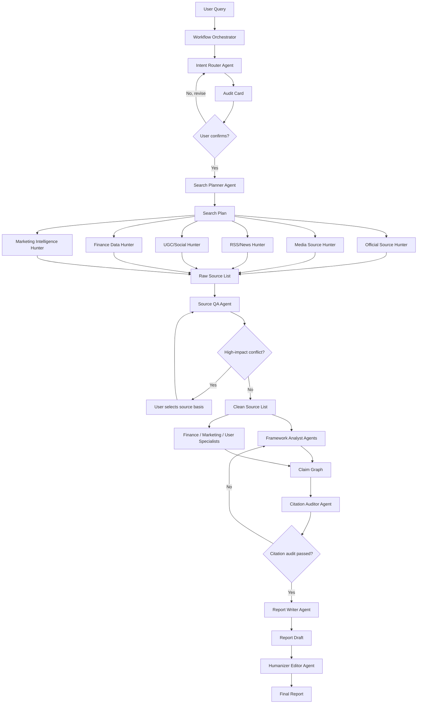

# Multi-Agent Search Workflow Design

**Date:** 2026-07-08
**Project:** search-agent-skill3.0
**Audience:** 百度地图市场组、调研工作流维护者、后续实现 agent

## Goal

Build a true multi-agent research pipeline for competitor, industry, finance, marketing, and user research. The system should not behave like a single agent with a long prompt. It should move structured artifacts from one agent node to the next, with explicit quality gates and source-backed outputs.

## Non-Goals

- Do not replace all existing tools at once.
- Do not make the CLI the primary intelligence layer.
- Do not let keyword matching decide research intent by itself.
- Do not produce final reports from templates before citation audit.
- Do not let Humanizer change facts, numbers, citations, or risk boundaries.

## Current Problem

The current project has the right pieces but not a reliable pipeline:

- `AGENTS.md` and `SKILL.md` define Step 0-3 at a high level.
- `references/agent-nodes.md` now defines node contracts and the required LLM-first decision stack.
- `lib/intent_classifier.py` provides useful fallback signals but cannot understand whole-user intent by itself.
- `lib/report_generator.py` can render structured reports and now has a conservative style cleanup pass.
- External skills are listed, but their outputs are not yet always captured as handoff artifacts.

The missing layer is an orchestrator that forces every agent to consume and produce typed artifacts.

## Design Principles

1. **LLM understanding first, rules second.** Rules are signal detectors and fallback paths. They do not own final intent classification.
2. **Artifacts over memory.** Every skill or agent result must be written into a structured artifact so later nodes can inspect it.
3. **Source IDs are the evidence spine.** No source ID, no factual claim.
4. **Parallelize only independent work.** Search across source classes can run in parallel; citation audit must wait for a complete draft.
5. **Human gates protect direction and trust.** The user confirms the audit card before search; citation failure blocks final report.
6. **Natural report, not AI template.** The report uses conclusion-first logic, then Humanizer Editor removes generic AI scaffolding.
7. **Every judgment node uses an LLM.** Tools fetch evidence, calculate metrics, or enforce schemas. LLM agents interpret meaning, choose tradeoffs, synthesize claims, challenge weak evidence, and adapt the report to the reader.

## LLM Responsibility Model

The workflow is not "LLM only in Step 0, tools afterward." Every node that makes a judgment needs an LLM. The orchestration rule is:

```text
LLM = judgment, synthesis, framing, tradeoff, writing
Tool/skill = retrieval, structured data, deterministic checks, domain method, rendering
Artifact = durable handoff between agents
```

| Node | LLM responsibility | Tool/skill responsibility | Output quality bar |
|---|---|---|---|
| Intent Router | Understand the user's real business decision, infer audience, detect ambiguity, decide whether to ask or proceed | `intent_classifier.py`, `framework_combinator.py`, `marketing-ideas`, `marketing-plan`, `startup-analysis`, `yfinance-data/funda-data` as probes/fallbacks | Audit card explains semantic reasoning, not just keyword hits |
| Search Planner | Translate the confirmed question into evidence requirements; decide which source class can prove each claim | `references/search-platforms.md`, keyword expansion, framework templates | Every framework dimension has a search task and expected evidence |
| Source Hunter | Judge which results are relevant enough to keep; decide whether a result is official, duplicate, secondary, or sentiment-only | Firecrawl, realtime-search, RSS, agent-reach, finance/marketing data skills | Source YAML contains key facts and confidence rationale |
| Source QA | Challenge source quality, identify missing evidence, reconcile date/metric conflicts | URL normalization, duplicate checks, date parsing, numeric comparison | High-impact conflicts are explicit and can pause the run |
| Framework Analyst | Turn sources into dimension-level claims; separate fact/calculation/assumption/judgment; reason across sources | Framework definitions, specialist skill outputs | ClaimGraph is source-backed and decision-relevant |
| Specialist Agents | Apply domain judgment: finance, marketing, user research, competitor strategy | Domain skills such as `company-valuation`, `customer-research`, `competitor-profiling`, `pricing` | Adds insight a generic analyst would miss |
| Citation Auditor | Read claim and source together; decide whether the source actually supports the sentence | Source map, citation existence checks | Unsupported claims are blocked or downgraded |
| Report Writer | Choose the right narrative shape for the reader; compress claim graph into a useful decision document | Report schema, reference table renderer | Report answers the decision, not just the framework |
| Humanizer Editor | Remove AI-like structure and stiff language while preserving meaning | `humanizer`, `copy-editing`, conservative phrase cleanup | Final report reads like a sharp internal research note |

LLM agents must record their judgment basis inside artifacts. For example, Source QA does not only say `confidence=medium`; it should say "medium because the article is a secondary media report and the original company post was unavailable."

## Architecture



## Artifact Contracts

### IntentBrief

Produced by Intent Router Agent.

```json
{
  "research_object": "高德地图",
  "user_decision": "判断百度地图是否需要跟进高德新功能",
  "audience": "百度地图市场组",
  "time_scope": "最近三个月",
  "output_shape": "竞品简报 + 行动建议",
  "evidence_need": ["官方更新", "应用商店", "媒体报道", "UGC反馈"],
  "ambiguity": ["是否启用内网知识库"],
  "semantic_signals": [
    {"signal": "上新了什么功能", "meaning": "竞品监测"},
    {"signal": "方案", "meaning": "需要行动建议"}
  ],
  "classifier_check": {
    "top_frameworks": ["同行竞争对比", "3C战略三角"],
    "conflicts": []
  },
  "preflight_skills": [
    {
      "skill": "marketing/competitor-profiling",
      "why": "补竞品档案维度",
      "status": "planned"
    }
  ]
}
```

### AuditCard

Produced by Intent Router Agent and shown to user. Search cannot start before confirmation.

Required fields:

- topic
- purpose
- LLM semantic read
- recommended framework or framework combination
- dimensions with concrete questions
- Chinese and English keyword families
- source scope
- planned expert skills
- open assumptions

### SearchPlan

Produced by Search Planner Agent.

```json
{
  "frameworks": ["同行竞争对比", "JTBD", "3C战略三角"],
  "tasks": [
    {
      "task_id": "SP001",
      "dimension": "竞品功能变化",
      "query_zh": ["高德地图 最近三个月 新功能", "高德地图 App Store 更新"],
      "query_en": ["Amap new features last 3 months"],
      "source_layers": ["official", "media", "app_store"],
      "expected_evidence": ["功能名称", "发布时间", "官方描述"],
      "source_id_prefix": "OFF"
    }
  ]
}
```

### SourceList

Produced by Source Hunter Agents.

```yaml
sources:
  - source_id: OFF001
    title: "高德地图 App 更新记录"
    publisher: "Apple App Store"
    source_type: 官方应用商店
    publish_date: 2026-06-30
    url: "https://..."
    confidence: high
    key_facts:
      - "版本更新包含暑期出行相关能力"
    full_text_fetched: true
    collected_by: Official Source Hunter
```

### SourceQANotes

Produced by Source QA Agent.

```json
{
  "deduped_count": 18,
  "removed_duplicates": ["MED004"],
  "stale_sources": ["RSS009"],
  "paywalled_summaries": ["MED003"],
  "number_conflicts": [
    {
      "metric": "MAU",
      "values": [
        {"source_id": "OFF002", "value": "4.5亿"},
        {"source_id": "MED006", "value": "5亿+"}
      ],
      "requires_user_decision": true
    }
  ],
  "approved_source_ids": ["OFF001", "MED002", "UGC003"]
}
```

### ClaimGraph

Produced by Framework Analyst and Specialist Agents.

```json
{
  "claims": [
    {
      "claim_id": "CL001",
      "dimension": "竞品功能变化",
      "claim_type": "fact",
      "text": "高德地图在最近三个月加强了暑期出行场景入口。",
      "source_ids": ["OFF001", "MED002"],
      "confidence": "high"
    },
    {
      "claim_id": "CL002",
      "dimension": "对百度地图启示",
      "claim_type": "judgment",
      "text": "百度地图应优先验证自然语言规划出行，而不是直接复制功能入口。",
      "source_ids": ["OFF001", "UGC003"],
      "confidence": "medium"
    }
  ]
}
```

### CitationAudit

Produced by Citation Auditor Agent.

```json
{
  "status": "pass",
  "issues": [],
  "required_rewrites": []
}
```

If the audit fails:

```json
{
  "status": "fail",
  "issues": [
    {
      "claim_id": "CL004",
      "problem": "source does not support the numeric claim",
      "required_action": "remove number or replace source"
    }
  ]
}
```

### ReportDraft and FinalReport

Produced by Report Writer Agent and Humanizer Editor Agent.

The report must keep:

- source-backed claims
- source IDs and reference links
- explicit uncertainty
- decision-oriented conclusion

The final pass removes:

- forced rule-of-three
- generic transitions
- abstract AI vocabulary
- inflated claims
- repeated section shapes that do not match the evidence

## Agent Nodes

### Workflow Orchestrator

**Purpose:** Own state and dispatch agents.

**Inputs:** User query, project config, available skill registry.

**Outputs:** Workflow state file and final report path.

**Responsibilities:**

- Create a workflow run ID.
- Store each artifact under `runs/<run_id>/`.
- Block search until AuditCard is confirmed.
- Dispatch source hunters in parallel.
- Route failed audits back to the right agent.
- Never create factual claims itself.

**LLM role:** Minimal. The orchestrator may summarize current state for handoff, but it must not infer business conclusions or rewrite claims. Its job is control flow.

### Intent Router Agent

**Purpose:** Understand the user decision and route the framework.

**Skills:**

- `marketing-ideas`: fuzzy growth/marketing prompts.
- `marketing-plan`: full campaign/GTM/marketing plan prompts.
- `startup-analysis`: startup, VC, joining, fundraising prompts.
- `yfinance-data` or `funda-data`: single finance number prompts.
- `intent_classifier.py`: fallback signals and regression check.
- `framework_combinator.py`: minimal framework combination.

**Output:** `IntentBrief` and `AuditCard`.

**Hard rule:** Search is forbidden before user confirmation.

**LLM role:** Mandatory. It must read the whole user request, infer unstated business context, and decide when a keyword match is misleading. Example: "给市场组一个方案" means the output needs implications/actions, not necessarily a full generic marketing plan.

### Search Planner Agent

**Purpose:** Translate the confirmed AuditCard into an executable SearchPlan.

**Skills and references:**

- `references/search-platforms.md`
- `references/frameworks.md`
- keyword expansion rules from `SKILL.md`

**Output:** `SearchPlan`.

**LLM role:** Mandatory. It must decide what kind of evidence would actually prove each dimension. Example: a "用户痛点" dimension needs UGC/user research; a "是否已发布" dimension needs official/app-store evidence.

### Source Hunter Agents

**Purpose:** Collect evidence in parallel.

| Agent | Skills / tools | Source ID prefix |
|---|---|---|
| Official Source Hunter | Firecrawl, realtime-search Brave, SEC/IR/site search | OFF / FC / RS |
| Media Source Hunter | Firecrawl, realtime-search 百度/Brave | MED / FC / RS |
| RSS/News Hunter | finance-rss-reader, news-aggregator-skill | RSS / SOC |
| UGC/Social Hunter | agent-reach, B站, 小红书, 知乎, Reddit, X | UGC / SOC |
| Finance Data Hunter | yfinance-data, funda-data, TradingView, AKShare when available | FIN / DAT |
| Marketing Intelligence Hunter | competitor-profiling, customer-research, directory-submissions | MKT |

**Output:** partial `SourceList` files merged by Orchestrator.

**LLM role:** Required for relevance filtering and fact extraction. A Source Hunter should not blindly dump search results; it should keep only items that match the SearchPlan, extract key facts, and explain source confidence.

### Source QA Agent

**Purpose:** Clean, rank, and challenge evidence.

**Responsibilities:**

- Deduplicate URLs.
- Normalize publisher and dates.
- Mark paywall summaries.
- Flag stale or low-confidence sources.
- Check key numbers across at least two independent sources when possible.
- Ask user when a high-impact metric conflicts.

**Output:** `SourceQANotes` and clean `SourceList`.

**LLM role:** Mandatory. QA requires judgment: whether two numbers are actually comparable, whether a source is stale for the decision, and whether social evidence can support only sentiment rather than fact.

### Framework Analyst Agents

**Purpose:** Convert sources into a claim graph by framework.

Run one analyst per confirmed framework when independent:

- `PEST Analyst`
- `3C Analyst`
- `JTBD Analyst`
- `AARRR Analyst`
- `SWOT/Risk Analyst`
- `KPI/Finance Analyst`

**Output:** partial `ClaimGraph` files merged by Orchestrator.

**LLM role:** Mandatory. This is a reasoning node. It must synthesize across sources, identify contradictions, and produce claims that answer the user's decision. It must not copy snippets into framework boxes.

### Specialist Agents

**Purpose:** Add domain-specific analysis that a generic analyst would miss.

| Specialist | Trigger | Skills |
|---|---|---|
| Finance Specialist | 财报、估值、股价、ROE、现金流、投资判断 | yfinance-data, funda-data, earnings-recap, company-valuation |
| Marketing Specialist | STP, 4P, GTM, pricing, channels, launch | marketing-plan, product-marketing, pricing, launch |
| User Research Specialist | JTBD, pain points, UGC, retention | customer-research, analytics, churn-prevention |
| Competitor Specialist | 竞品功能、定位、渠道、融资、团队 | competitor-profiling, competitors, directory-submissions |

**Output:** additional claims and notes appended to `ClaimGraph`.

**LLM role:** Mandatory. Specialist agents use domain skills as inputs, then interpret what the outputs mean for the decision. For example, `company-valuation` can produce valuation scenarios, but the Finance Specialist explains which assumptions drive the conclusion and how reliable they are.

## Finance and Marketing Skill Chains

Financial and marketing skills must be chained through specialist agents, not called as isolated helpers. Each chain has four stages:

```text
LLM frames specialist question
  -> specialist skill/tool produces method output
  -> LLM interprets output against the user's decision
  -> interpreted result becomes source-backed ClaimGraph entries
```

### Finance Specialist Chain

**When used:** public company research, financial performance, valuation, investment judgment, risk, liquidity, sentiment, single-number finance lookup.

**Core logic:**

1. **Classify finance need with LLM.**
   - Is the user asking for a single number, a financial health read, valuation, earnings reaction, risk, or investment-style synthesis?
   - If single number, short-circuit after data retrieval.
   - If synthesis, continue into Step 1/2 as a full finance chain.

2. **Choose data skills.**

| Finance question | Primary skill | Supporting skill | Output artifact |
|---|---|---|---|
| Latest price, market cap, basic financial number | `yfinance-data` | `funda-data` if yfinance unavailable or richer data needed | `FIN###` source row |
| Earnings recap / "Q1 怎么样" | `earnings-recap` | `funda-data`, RSS, transcript search | earnings claim set |
| Earnings preview / expectations | `earnings-preview` | `estimate-analysis`, `funda-data` | expectations and surprise-risk claims |
| Fair value / overvalued / undervalued | `company-valuation` | `yfinance-data`, `funda-data`, peer search | valuation scenarios |
| Estimate revisions | `estimate-analysis` | RSS, transcript search | revision-trend claims |
| Liquidity / tradability risk | `stock-liquidity` | market data | liquidity-risk claims |
| Correlation / hedge / factor exposure | `stock-correlation` | sector peer data | correlation claims |
| Options strategy | `options-payoff` | `tradingview-reader` | payoff/risk chart claims |
| Market sentiment | `finance-sentiment` | Reddit/X/news RSS | sentiment claims, confidence low/medium |

3. **LLM interprets method output.**
   - The skill output is not the final conclusion.
   - The Finance Specialist LLM must explain which assumptions matter, what changed, what is comparable, and where confidence is weak.
   - Every number must include period, currency, unit, and source.

4. **Write ClaimGraph entries.**

Example:

```json
{
  "claim_id": "FIN_CL001",
  "dimension": "估值",
  "claim_type": "judgment",
  "text": "DCF 和相对估值给出的区间分歧较大，主要因为终端增长率和同行倍数假设敏感；因此估值结论应以情景区间呈现，而不是单点价格。",
  "source_ids": ["FIN001", "FIN002"],
  "method": "company-valuation",
  "assumptions": ["WACC", "terminal growth", "peer median EV/EBITDA"],
  "confidence": "medium"
}
```

**Hard constraints:**

- Never let valuation skill output become investment advice without LLM risk framing and disclaimer.
- Never compare financial numbers without checking period and currency.
- Never cite market sentiment as a fact about company performance.
- If data providers disagree, Source QA must flag the conflict before analysis proceeds.

### Marketing Specialist Chain

**When used:** growth, GTM, positioning, STP, 4P, AARRR, user research, brand, campaign planning, channel strategy, competitor positioning.

**Core logic:**

1. **Classify marketing need with LLM.**
   - Is the user asking for ideas, a full plan, positioning, pricing, launch, channel analysis, customer insight, or competitor intelligence?
   - If fuzzy, use `marketing-ideas` before framework selection.
   - If plan-shaped, use `marketing-plan` to structure report family and execution sections.

2. **Choose marketing skills.**

| Marketing question | Primary skill | Supporting skill | Output artifact |
|---|---|---|---|
| "帮我想想方向/灵感" | `marketing-ideas` | `marketing-psychology` if persuasion angle needed | idea candidates |
| Full marketing/GTM/growth plan | `marketing-plan` | `product-marketing`, `pricing`, `analytics` | plan skeleton and AARRR map |
| Positioning / ICP / messaging | `product-marketing` | `customer-research`, `copywriting` | positioning claims |
| Customer pain / JTBD / VOC | `customer-research` | UGC Source Hunter, `analytics` | VOC/JTBD claim set |
| Competitor profile | `competitor-profiling` | `competitors`, `directory-submissions` | competitor dossier claims |
| Pricing / packaging | `pricing` | `offers`, `paywalls` | pricing hypothesis claims |
| Acquisition / SEO | `seo-audit`, `ai-seo`, `programmatic-seo`, `schema` | `content-strategy` | acquisition claims |
| Activation | `signup`, `onboarding`, `cro` | analytics source | activation bottleneck claims |
| Retention | `churn-prevention`, `emails`, `sms` | customer-research | retention claims |
| Referral/community | `referrals`, `community-marketing`, `co-marketing` | social/UGC sources | referral claims |
| Ads / campaign creative | `ads`, `ad-creative`, `copywriting` | `copy-editing` | creative direction claims |

3. **LLM interprets marketing skill output.**
   - Marketing skills often generate many tactics. The Marketing Specialist LLM must prioritize based on the user's audience, team capacity, budget, funnel stage, and evidence.
   - It must separate "idea", "hypothesis", "validated insight", and "recommended action".
   - It must connect every recommended action to a metric.

4. **Write ClaimGraph entries.**

Example:

```json
{
  "claim_id": "MKT_CL001",
  "dimension": "增长杠杆",
  "claim_type": "judgment",
  "text": "暑期增长不应先从大规模品牌投放切入，而应先验证亲子/旅游场景的自然语言路线规划入口，因为该动作同时服务 Activation 和 Retention。",
  "source_ids": ["UGC002", "MKT001"],
  "method": "marketing-ideas + customer-research",
  "metric_link": ["first-route-created rate", "7-day repeat navigation rate"],
  "confidence": "medium"
}
```

**Hard constraints:**

- Never output generic actions like "加强宣传" or "提升体验" without mechanism, target segment, channel, and metric.
- Never treat UGC volume as market size.
- Never turn `marketing-plan` into a 13-section dump when the user asked for a concise market-team memo.
- Every recommendation must map to a funnel stage or strategic objective.

### Finance x Marketing Mixed Chain

Many real questions cross both domains. Examples: "小米汽车品牌力对股价的影响", "Temu 增长故事值不值得投", "SaaS IPO 前增长质量".

**Flow:**

1. Intent Router detects mixed finance x marketing framing.
2. AuditCard asks for lens: investor, operator, or new-business evaluation.
3. Finance Specialist produces financial baseline: growth, margin, valuation, estimate/risk.
4. Marketing/User/Competitor Specialists produce market mechanism: brand, acquisition, retention, pricing, competitive moat.
5. Framework Analyst connects the causal chain:

```text
marketing signal -> user behavior -> unit economics -> financial metric -> valuation/risk implication
```

Example:

```json
{
  "claim_id": "MIX_CL001",
  "dimension": "品牌到财务传导",
  "claim_type": "judgment",
  "text": "品牌热度只有在带来可复购订单或更低获客成本时才支撑估值上修；如果只停留在声量，财务传导证据不足。",
  "source_ids": ["MKT003", "FIN002"],
  "causal_chain": ["brand attention", "conversion/CAC", "gross profit", "valuation multiple"],
  "confidence": "medium"
}
```

**Hard constraints:**

- No direct jump from "品牌声量高" to "股价应上涨".
- No direct jump from "营收增长" to "营销有效" without channel/user evidence.
- If the causal chain has a missing link, label it as an assumption and propose the metric needed to verify it.

### Citation Auditor Agent

**Purpose:** Keep the report honest.

**Responsibilities:**

- Verify source IDs exist.
- Verify each cited source supports the sentence.
- Reject unsupported numbers.
- Require downgrade when evidence is weak.

**Output:** `CitationAudit`.

**LLM role:** Mandatory. Citation audit is semantic, not only mechanical. It must compare the sentence to the cited evidence and decide whether the source supports the exact claim, a weaker claim, or no claim.

### Report Writer Agent

**Purpose:** Write the decision-oriented report from the approved claim graph.

**Responsibilities:**

- Answer the user's decision first.
- Use conclusion-first structure without forcing an artificial template.
- Keep every material factual claim cited.
- Include risk and uncertainty.

**Output:** `ReportDraft`.

**LLM role:** Mandatory. Report writing is not template filling. The writer chooses a report shape based on reader, decision, evidence strength, and urgency.

### Humanizer Editor Agent

**Purpose:** Remove AI-like writing after evidence is safe.

**Skills:**

- `humanizer`
- `copy-editing`

**Responsibilities:**

- Remove empty transitions and formulaic phrasing.
- Avoid forced rule-of-three.
- Replace generic consultant prose with concrete language.
- Preserve citations, numbers, caveats, and factual scope.

**Output:** `FinalReport`.

**LLM role:** Mandatory. Humanizer is an editorial LLM pass. It removes AI-like writing patterns while preserving citations, evidence strength, numbers, and risk caveats.

## Report Template Strategy

The report template is not finalized yet. High-quality output requires choosing the right template for the business context before implementation.

The system should support several report families. The AuditCard must show the proposed report family and let the user adjust it.

### Template Family A: Executive Decision Memo

**Best for:** 百度地图市场组/产品策略需要快速决定是否跟进、反制、观察。

**Shape:**

```markdown
# [主题] 决策简报

## 先给结论
[1-3 句话，直接回答该不该做、先做什么、不做什么]

## 为什么现在要看
[事件/竞品动作/窗口期，带来源]

## 证据
[按证据强弱组织，不机械按 3 点]

## 对百度地图的含义
[机会、威胁、可利用的差异点]

## 建议动作
[P0/P1/P2；负责人类型；验证方式]

## 风险和未证实项
[不能确定的地方]

## 参考文献
```

**Quality bar:** Short, sharp, action-oriented. Avoid academic framework exposition unless it changes the decision.

### Template Family B: Deep Research Report

**Best for:** 行业研究、重要竞品专题、领导汇报、需要完整证据链的报告。

**Shape:**

```markdown
# [主题] 深度调研报告

## 核心判断
## 研究范围和方法
## 信息源覆盖
## 框架分析章节
## 关键反证
## 风险与不确定性
## 可跟踪指标
## 参考文献
```

**Quality bar:** Evidence-first and inspectable. Framework chapters can be longer, but every section must earn its place.

### Template Family C: Competitive Battlecard

**Best for:** 高德/腾讯/Google Maps 等竞品功能、定位、渠道、用户反馈跟踪。

**Shape:**

```markdown
# [竞品] Battlecard

## 这次变化是什么
## 竞品意图判断
## 功能/体验/渠道对比
## 用户反馈和情绪
## 我方风险
## 我方可打的点
## 下一步监控
## 来源
```

**Quality bar:** Useful to product/marketing teams in a meeting. Tables are welcome, but not as a substitute for judgment.

### Template Family D: Finance/Investment Note

**Best for:** 财报、估值、经营质量、风险评估。

**Shape:**

```markdown
# [公司] 研究笔记

## 结论和评级口径
## 关键数字
## 驱动因素
## 预期差
## 估值/情景
## 风险
## 不构成投资建议声明
## 参考文献
```

**Quality bar:** Numeric precision over rhetorical polish. Every number needs period, currency, and source.

### Template Family E: Growth / GTM Plan

**Best for:** 增长方向、营销打法、渠道策略、活动方案。

**Shape:**

```markdown
# [主题] 增长方案

## 目标和约束
## 用户/场景洞察
## 增长杠杆
## 推荐打法
## 实验设计
## 指标和埋点
## 风险
## 来源
```

**Quality bar:** Must connect insight -> action -> metric. No generic "加强宣传/提升体验" without concrete mechanism.

### Template Selection Rules

| User intent | Default report family |
|---|---|
| "给市场组一个方案", "有什么启示", "要不要跟进" | Executive Decision Memo |
| "完整调研", "系统分析", "行业格局" | Deep Research Report |
| "竞品对比", "上新了什么功能", "谁更强" | Competitive Battlecard |
| "财报", "估值", "值不值得投", "风险" | Finance/Investment Note |
| "增长", "获客", "留存", "GTM", "活动方案" | Growth / GTM Plan |

The Report Writer Agent can combine families, but it must name the chosen family in the AuditCard. Example: "Competitive Battlecard + Executive Decision Memo" for a competitor update that also needs actions.

## State Storage

Default recommendation: keep generated run artifacts outside git by default under `.search-agent-runs/`, with an environment override for teams that want a shared output directory. This keeps real research evidence, paywalled summaries, and internal notes out of commits.

```text
.search-agent-runs/
  <run_id>/
    intent_brief.json
    audit_card.md
    search_plan.json
    sources_raw.yaml
    source_qa.json
    sources_clean.yaml
    claim_graph.json
    citation_audit.json
    report_draft.md
    final_report.md
```

Only curated final reports should be copied into `output/` or another user-selected folder.

The run ID format:

```text
YYYYMMDD-HHMMSS-slug
```

Example:

```text
20260708-153000-amap-summer-features
```

## Human Gates

### Gate 1: Audit Card Confirmation

Before search, the user must confirm:

- research topic
- purpose
- framework
- dimensions
- keywords
- source scope
- planned expert skills

### Gate 2: Source Conflict

Pause when:

- two high-confidence sources disagree on a key number
- official source is missing for a financial or regulatory claim
- only social/UGC sources support a factual claim

### Gate 3: Citation Audit

Final report cannot be generated until Citation Auditor passes or all issues are resolved.

## Failure Handling

| Failure | Handling |
|---|---|
| Expert skill unavailable | Record fallback in artifact and use closest source/tool |
| Firecrawl unavailable | Fall back to realtime-search and RSS, mark coverage gap |
| UGC source blocked | Use site search or skip with `access_issue` note |
| Key metric conflict | Ask user to choose source basis |
| Citation audit fails | Return claim to analyst or downgrade wording |
| Humanizer changes meaning | Reject final report and restore audited draft |

## Default Runtime Choices

1. **Artifact storage:** `.search-agent-runs/` outside git by default; configurable with `SEARCH_AGENT_RUNS_DIR`.
2. **UGC sources:** enabled by default for competitor, user, brand, and growth research; disabled by default for pure financial number lookups and regulatory/filing-only tasks.
3. **First implementation target:** Codex-native orchestration first. CLI should expose the same artifacts later, but it should remain a runner/fallback rather than the primary intelligence layer.
4. **Parallel execution:** run source hunters in parallel first; keep analyst parallelism behind a feature flag until source QA and citation audit are reliable.

## Implementation Plan Shape

The implementation should be built in layers:

1. Define artifact dataclasses and JSON/YAML serialization.
2. Build `WorkflowOrchestrator` with sequential execution and gates.
3. Add source hunter interfaces and adapters around existing scripts.
4. Add analyst and specialist interfaces.
5. Add citation audit pass.
6. Add Humanizer Editor pass.
7. Add tests for each artifact transition and failure gate.

## Acceptance Criteria

- A fuzzy growth prompt triggers `marketing-ideas` in Step 0 and produces an AuditCard before any search.
- A single finance number prompt uses `yfinance-data` or `funda-data` and short-circuits full reporting.
- A competitor monitoring prompt produces a SearchPlan with official, media, RSS, and UGC source tasks.
- Source Hunter outputs merge into a valid `SourceList`.
- Source QA blocks high-impact metric conflicts.
- Framework Analyst output contains only claims with source IDs or explicit low-confidence assumptions.
- Citation Auditor blocks unsupported numbers.
- Report Writer produces a decision-oriented report from ClaimGraph, not from raw search snippets.
- Humanizer Editor removes AI-like scaffolding without changing citations or numbers.
- Every final report includes a reference table with clickable source links.

## Open Questions for User Review

1. Do you agree with `.search-agent-runs/` as the default artifact store?
2. Do you agree that UGC should be enabled by default for 百度地图 competitor/user/growth research?
3. Do you agree that implementation should target Codex-native orchestration first, with CLI full workflow support later?
