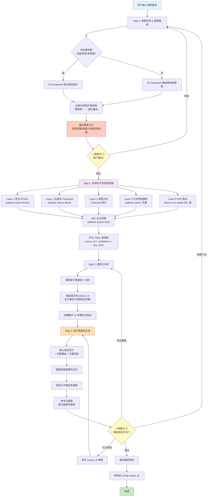

# Search Agent 工作流程图（v3.0 Codex-ready）

对应 SKILL.md 的 Step 0 → Step 1 → Step 2 → Step 3 四段式主流程。

## 与 CLAUDE.md 的差异（v3.0 融合后）

- **保留 CLAUDE.md 精华**：审核卡片格式、YAML 源清单、金字塔报告、强制引文、质量红线（禁模糊词、数字必带口径）
- **保留 v2.3 优势并扩展**：9 框架 + 7 组合规则、5 层分层搜索、65+ 个财经/产业/AI 媒体源
- **新增 Firecrawl 层**：填补英文深度内容（Seeking Alpha / FT / SEC）短板
- **两条路径**：Codex 原生走 prompt（SKILL.md），脚本党走 `bin/search_agent.py` CLI

## 关键设计原则

1. **框架先于搜索**：先决定要支撑什么判断，再决定查什么资料
2. **官方来源优先**：Layer 1 → Layer 5 按 confidence 排序
3. **引文透明**：每个论断绑定 source_id，报告末尾必须列参考文献表
4. **两个人工闸门**：审核点①（选框架）+ 审核点②（校引文/结论）
5. **可扩展**：新框架加 `references/frameworks.md` + `lib/frameworks.py`；新源加脚本 + 更新 SKILL.md Step 1
